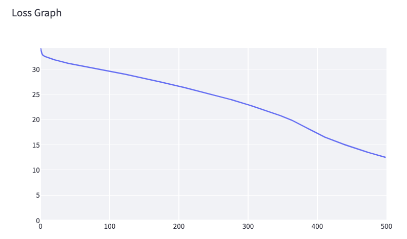

[](https://classroom.github.com/a/YFgwt0yY)
# MiniTorch Module 2


* Docs: https://minitorch.github.io/

* Overview: https://minitorch.github.io/module2/module2/

This assignment requires the following files from the previous assignments. You can get these by running

```bash
python sync_previous_module.py previous-module-dir current-module-dir
```

The files that will be synced are:

        minitorch/operators.py minitorch/module.py minitorch/autodiff.py minitorch/scalar.py minitorch/scalar_functions.py minitorch/module.py project/run_manual.py project/run_scalar.py project/datasets.py

# Module 2.5 Results

## Simple Dataset


```bash
Time per epoch: 0.032s

Epoch: 10/500, loss: 34.27300340800095, correct: 25
Epoch: 20/500, loss: 34.193338558238565, correct: 25
Epoch: 30/500, loss: 34.10356785498929, correct: 25
Epoch: 40/500, loss: 33.99096596072884, correct: 25
Epoch: 50/500, loss: 33.86825791884751, correct: 25
Epoch: 60/500, loss: 33.73250030319294, correct: 25
Epoch: 70/500, loss: 33.57425617942474, correct: 25
Epoch: 80/500, loss: 33.3938009208378, correct: 25
Epoch: 90/500, loss: 33.17061329058098, correct: 25
Epoch: 100/500, loss: 32.90240932254908, correct: 25
Epoch: 110/500, loss: 32.60516873564207, correct: 25
Epoch: 120/500, loss: 32.2606742263149, correct: 25
Epoch: 130/500, loss: 31.925159004654684, correct: 25
Epoch: 140/500, loss: 31.54448492878233, correct: 37
Epoch: 150/500, loss: 31.11190573272952, correct: 37
Epoch: 160/500, loss: 30.623994462743358, correct: 37
Epoch: 170/500, loss: 30.091070700099536, correct: 37
Epoch: 180/500, loss: 29.504521895650214, correct: 37
Epoch: 190/500, loss: 28.86266854062611, correct: 39
Epoch: 200/500, loss: 28.16724795760508, correct: 39
Epoch: 210/500, loss: 27.421032257096694, correct: 41
Epoch: 220/500, loss: 26.62747571457239, correct: 42
Epoch: 230/500, loss: 25.803869561908485, correct: 44
Epoch: 240/500, loss: 24.93908978514329, correct: 44
Epoch: 250/500, loss: 24.030813096810448, correct: 44
Epoch: 260/500, loss: 23.08323521009705, correct: 45
Epoch: 270/500, loss: 22.100430816587394, correct: 45
Epoch: 280/500, loss: 21.094818418701262, correct: 45
Epoch: 290/500, loss: 20.07273357054341, correct: 45
Epoch: 300/500, loss: 19.04236980158947, correct: 45
Epoch: 310/500, loss: 18.027522293905232, correct: 45
Epoch: 320/500, loss: 17.22824856994794, correct: 45
Epoch: 330/500, loss: 16.51290917567438, correct: 45
Epoch: 340/500, loss: 15.837535107696752, correct: 45
Epoch: 350/500, loss: 15.236725260953897, correct: 46
Epoch: 360/500, loss: 14.674349494469405, correct: 46
Epoch: 370/500, loss: 14.15566724270603, correct: 46
Epoch: 380/500, loss: 13.655008481766938, correct: 48
Epoch: 390/500, loss: 13.171832456392154, correct: 49
Epoch: 400/500, loss: 12.707034202980218, correct: 49
Epoch: 410/500, loss: 12.261479960348971, correct: 49
Epoch: 420/500, loss: 11.835800115467434, correct: 49
Epoch: 430/500, loss: 11.43035418297941, correct: 49
Epoch: 440/500, loss: 11.04522890894519, correct: 49
Epoch: 450/500, loss: 10.68025325211361, correct: 49
Epoch: 460/500, loss: 10.335026083115807, correct: 50
Epoch: 470/500, loss: 10.012356913114408, correct: 50
Epoch: 480/500, loss: 9.716719278615583, correct: 50
Epoch: 490/500, loss: 9.438007901187822, correct: 50
Epoch: 500/500, loss: 9.174549755919811, correct: 50
```

## Diag Dataset


```bash
Time per epoch: 0.069s

Epoch: 10/200, loss: 16.150294753230906, correct: 43
Epoch: 20/200, loss: 11.324662142153551, correct: 43
Epoch: 30/200, loss: 7.8789601652416, correct: 47
Epoch: 40/200, loss: 5.85946160861651, correct: 48
Epoch: 50/200, loss: 4.600093924787148, correct: 49
Epoch: 60/200, loss: 3.7851250430088283, correct: 49
Epoch: 70/200, loss: 3.21889542771781, correct: 49
Epoch: 80/200, loss: 2.799292332777859, correct: 49
Epoch: 90/200, loss: 2.4740885254618226, correct: 50
Epoch: 100/200, loss: 2.2134771181947657, correct: 50
Epoch: 110/200, loss: 1.9995542968988083, correct: 50
Epoch: 120/200, loss: 1.822357607315944, correct: 50
Epoch: 130/200, loss: 1.6727703004436059, correct: 50
Epoch: 140/200, loss: 1.5434302150523147, correct: 50
Epoch: 150/200, loss: 1.4303535008826849, correct: 50
Epoch: 160/200, loss: 1.3302531592480993, correct: 50
Epoch: 170/200, loss: 1.2413476037952784, correct: 50
Epoch: 180/200, loss: 1.1615687786677071, correct: 50
Epoch: 190/200, loss: 1.0895512920642563, correct: 50
Epoch: 200/200, loss: 1.0242606367358384, correct: 50
```

## Split Dataset


```bash
Time per epoch: 0.269s

Epoch: 0/500, loss: 0, correct: 0
Epoch: 10/500, loss: 32.2276239181178, correct: 32
Epoch: 20/500, loss: 31.74570302867102, correct: 32
Epoch: 30/500, loss: 31.427172596956474, correct: 34
Epoch: 40/500, loss: 31.143930088714804, correct: 35
Epoch: 50/500, loss: 30.94884795858845, correct: 37
Epoch: 60/500, loss: 30.757044237388843, correct: 38
Epoch: 70/500, loss: 30.58095431976821, correct: 38
Epoch: 80/500, loss: 30.40938685371586, correct: 38
Epoch: 90/500, loss: 30.251234542023624, correct: 38
Epoch: 100/500, loss: 30.056721838385187, correct: 38
Epoch: 110/500, loss: 29.51296777119542, correct: 38
Epoch: 120/500, loss: 28.9854665899538, correct: 39
Epoch: 130/500, loss: 28.629539707114603, correct: 40
Epoch: 140/500, loss: 28.29639075765426, correct: 40
Epoch: 150/500, loss: 27.942372268955012, correct: 40
Epoch: 160/500, loss: 27.58198313355403, correct: 40
Epoch: 170/500, loss: 27.220462803226646, correct: 40
Epoch: 180/500, loss: 26.871194120559704, correct: 40
Epoch: 190/500, loss: 26.53323600043306, correct: 40
Epoch: 200/500, loss: 26.207279937385977, correct: 40
Epoch: 210/500, loss: 25.873753312612134, correct: 40
Epoch: 220/500, loss: 25.50775970516816, correct: 40
Epoch: 230/500, loss: 25.12611749939527, correct: 40
Epoch: 240/500, loss: 24.72758294989985, correct: 40
Epoch: 250/500, loss: 24.312993358310408, correct: 40
Epoch: 260/500, loss: 23.882811740787847, correct: 40
Epoch: 270/500, loss: 23.434353587213202, correct: 40
Epoch: 280/500, loss: 22.973607949514204, correct: 40
Epoch: 290/500, loss: 22.49049630853359, correct: 40
Epoch: 300/500, loss: 21.966465032860814, correct: 40
Epoch: 310/500, loss: 21.43079744754646, correct: 40
Epoch: 320/500, loss: 20.87450426957132, correct: 41
Epoch: 330/500, loss: 20.240810623459243, correct: 41
Epoch: 340/500, loss: 19.402342569208106, correct: 41
Epoch: 350/500, loss: 18.581031121049534, correct: 41
Epoch: 360/500, loss: 17.784251641565795, correct: 42
Epoch: 370/500, loss: 17.02929467429783, correct: 43
Epoch: 380/500, loss: 16.295539928627626, correct: 43
Epoch: 390/500, loss: 15.580168384500414, correct: 43
Epoch: 400/500, loss: 14.887685114944308, correct: 44
Epoch: 410/500, loss: 14.21039887015465, correct: 48
Epoch: 420/500, loss: 13.56165974684885, correct: 48
Epoch: 430/500, loss: 12.913073579351419, correct: 48
Epoch: 440/500, loss: 12.294570261839612, correct: 49
Epoch: 450/500, loss: 11.67649644542498, correct: 49
Epoch: 460/500, loss: 11.085845194417145, correct: 49
Epoch: 470/500, loss: 10.517105475152277, correct: 49
Epoch: 480/500, loss: 9.992862270521098, correct: 49
Epoch: 490/500, loss: 9.50377235406845, correct: 50
Epoch: 500/500, loss: 9.041489369997356, correct: 50
```

## Xor Dataset



```bash
Time per epoch: 0.268s

Epoch: 10/500, loss: 32.38430229998676, correct: 30
Epoch: 20/500, loss: 31.918475465750927, correct: 30
Epoch: 30/500, loss: 31.51382196407377, correct: 31
Epoch: 40/500, loss: 31.190913681385354, correct: 31
Epoch: 50/500, loss: 30.93959968099967, correct: 33
Epoch: 60/500, loss: 30.693071505579503, correct: 33
Epoch: 70/500, loss: 30.448377070587522, correct: 34
Epoch: 80/500, loss: 30.192877651128647, correct: 34
Epoch: 90/500, loss: 29.935432911930604, correct: 34
Epoch: 100/500, loss: 29.677531774378355, correct: 34
Epoch: 110/500, loss: 29.405729611206894, correct: 34
Epoch: 120/500, loss: 29.10250574498452, correct: 35
Epoch: 130/500, loss: 28.803872609181138, correct: 36
Epoch: 140/500, loss: 28.5172660943392, correct: 36
Epoch: 150/500, loss: 28.223816263463107, correct: 37
Epoch: 160/500, loss: 27.918629964552995, correct: 37
Epoch: 170/500, loss: 27.605954630164042, correct: 37
Epoch: 180/500, loss: 27.293314066366744, correct: 37
Epoch: 190/500, loss: 26.975162914181098, correct: 35
Epoch: 200/500, loss: 26.652314646110845, correct: 35
Epoch: 210/500, loss: 26.32483137967457, correct: 36
Epoch: 220/500, loss: 25.990828470994977, correct: 38
Epoch: 230/500, loss: 25.652839064304924, correct: 38
Epoch: 240/500, loss: 25.307780588086388, correct: 38
Epoch: 250/500, loss: 24.955369970509892, correct: 39
Epoch: 260/500, loss: 24.588765009348318, correct: 40
Epoch: 270/500, loss: 24.211038912354095, correct: 40
Epoch: 280/500, loss: 23.831139465478945, correct: 42
Epoch: 290/500, loss: 23.420451810160188, correct: 43
Epoch: 300/500, loss: 22.996004032388456, correct: 44
Epoch: 310/500, loss: 22.557247315897627, correct: 44
Epoch: 320/500, loss: 22.103189120141348, correct: 46
Epoch: 330/500, loss: 21.635043824306813, correct: 46
Epoch: 340/500, loss: 21.155942444719994, correct: 46
Epoch: 350/500, loss: 20.672092532917233, correct: 46
Epoch: 360/500, loss: 20.137342823924694, correct: 46
Epoch: 370/500, loss: 19.48769282238173, correct: 46
Epoch: 380/500, loss: 18.764961854948535, correct: 47
Epoch: 390/500, loss: 18.04499937203841, correct: 47
Epoch: 400/500, loss: 17.28773290992871, correct: 47
Epoch: 410/500, loss: 16.63239502406307, correct: 48
Epoch: 420/500, loss: 16.074798223209815, correct: 48
Epoch: 430/500, loss: 15.55118734771669, correct: 48
Epoch: 440/500, loss: 15.049530793320272, correct: 48
Epoch: 450/500, loss: 14.574015506459732, correct: 48
Epoch: 460/500, loss: 14.120802366871537, correct: 48
Epoch: 470/500, loss: 13.68163564387852, correct: 48
Epoch: 480/500, loss: 13.257004035682016, correct: 48
Epoch: 490/500, loss: 12.864699075452872, correct: 48
Epoch: 500/500, loss: 12.4943983923825, correct: 48
```

